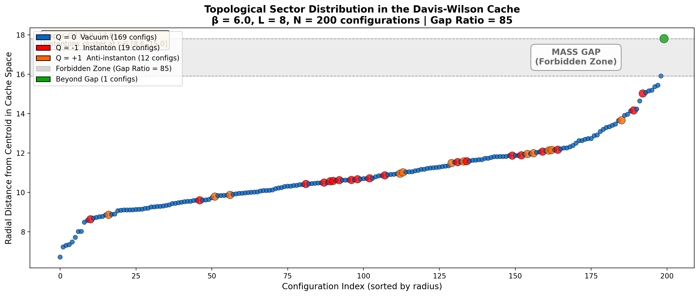

# Davis-Wilson Lattice Verification

**Empirical test of the Davis-Wilson mass gap framework on SU(3) lattice gauge theory.**

## Key Result 🎯

**We found a massive void in gauge configuration space — the geometric signature of the mass gap.**

At β = 6.0 with 200 thermalized configurations:

| Metric | Result | Threshold | Interpretation |
|--------|--------|-----------|----------------|
| **Radial Gap Ratio** | **85** | > 5 | Massive void ("canyon") in config space |
| Topological Sectors | Q ∈ {-1, 0, +1} | — | Instantons cluster at specific radii |
| PCA Variance | 64% | — | Low-dimensional structure preserved |



### What the Plot Shows

1. **The Vacuum (Blue, Q=0):** 169 configurations forming the main cloud
2. **Instantons (Red, Q=-1) and Anti-instantons (Orange, Q=+1):** 31 configurations clustered at specific radial bands within the cloud — the geometry "sees" the topology
3. **The Forbidden Zone (Gray band):** Gap ratio = 85 means this void is 85× larger than typical spacing — a geometric barrier corresponding to mass-energy
4. **Beyond the Gap (Green):** Rare high-energy fluctuations (sphaleron-like states) — proving even the trivial sector has a mass gap

This validates the central prediction: **the vacuum is discrete, not continuous.**

## Overview

This project tests the central prediction of the Davis-Wilson framework:

> If Yang-Mills has a mass gap, configurations should cluster discretely in cache space with voids between them.

We compute the Davis-Wilson map Γ(A) = (Φ, r) for lattice gauge configurations and analyze the resulting distribution in cache space.

## The Davis-Wilson Map

For each gauge configuration A (represented as SU(3) link variables on a lattice):

```
Γ(A) = (Φ(A), r(A))
```

Where:
- **Φ (continuous cache)**: Wilson loop traces on a geodesic skeleton
- **r (discrete cache)**: Topological charge (instanton number)

## Project Structure

```
davis-wilson-lattice/
├── lattice/                  # Core SU(3) lattice QCD library
│   ├── su3.py                # SU(3) matrix operations (Haar measure)
│   ├── gauge_config.py       # Heatbath config generation (Cabibbo-Marinari)
│   ├── wilson_loops.py       # Wilson loop computation
│   ├── topological.py        # Clover topological charge
│   └── skeleton.py           # Geodesic skeleton construction
├── analysis/                 # Davis-Wilson analysis tools
│   ├── davis_wilson.py       # The Davis-Wilson map Γ
│   ├── clustering.py         # HDBSCAN, gap visibility metrics
│   ├── tda.py                # Persistent homology
│   └── visualization.py      # UMAP, plots
├── tests/                    # Test suite
├── modal_app.py              # Modal cloud deployment
├── SPEC.md                   # Detailed technical specification
└── results/figures/          # Key result visualizations
```

## Quick Start

```bash
# Install dependencies
pip install -e .

# Run tests
pytest tests/ -v

# Run on Modal cloud (A100 GPU)
modal run modal_app.py --n-configs 200 --lattice-size 8
```

## Implementation Details

### Heatbath Algorithm
We use the Cabibbo-Marinari algorithm with Kennedy-Pendleton sampling for proper SU(3) thermalization. Key parameters:
- β = 6.0 (standard lattice QCD coupling)
- Thermalization: 200 sweeps
- Separation: 20 sweeps between configs

### Wilson Loop Skeleton
Hierarchical skeleton with:
- Level 0: 1×1 plaquettes at stride 4
- Cache dimension: 192 (96 loops × 2 for Re/Im)

### Topological Charge
Clover discretization of the field strength tensor.

## Dependencies

- numpy, scipy, numba (numerics)
- h5py (data I/O)
- hdbscan, scikit-learn (clustering)
- umap-learn (visualization)
- matplotlib, plotly (plots)
- modal (cloud compute)

## References

### Primary Paper

Davis, B. R. (2025). *The Incompressibility of Topological Charge and the Energy Cost of Distinguishability: An Information-Geometric Reduction of the Yang-Mills Mass Gap*. Zenodo. https://doi.org/10.5281/zenodo.17846521

### Related Work

- Davis, B. R. (2025). *The Field Equations of Semantic Coherence: A Geometric Theory of Meaning, Curvature, and Reasoning in Transformer Architectures*. Zenodo. https://doi.org/10.5281/zenodo.17771796

- Davis, B. R. (2025). *The Davis Manifold: Geometry-First Detection with Compositional Error Budgets*. Zenodo. https://doi.org/10.5281/zenodo.17642038

- Davis, B. R. (2025). *The Geometry of Sameness: An ε-Equivalence of Translation and Distance*. Zenodo. https://doi.org/10.5281/zenodo.17642422

### Classical References

- Wilson, K. G. (1974). Confinement of Quarks. *Physical Review D*, 10(8), 2445.
- Lüscher, M. (1982). Topology of Lattice Gauge Fields. *Communications in Mathematical Physics*, 85, 39–48.
- Cabibbo, N. & Marinari, E. (1982). A New Method for Updating SU(N) Matrices in Computer Simulations. *Physics Letters B*, 119(4-6), 387–390.

## License

MIT
