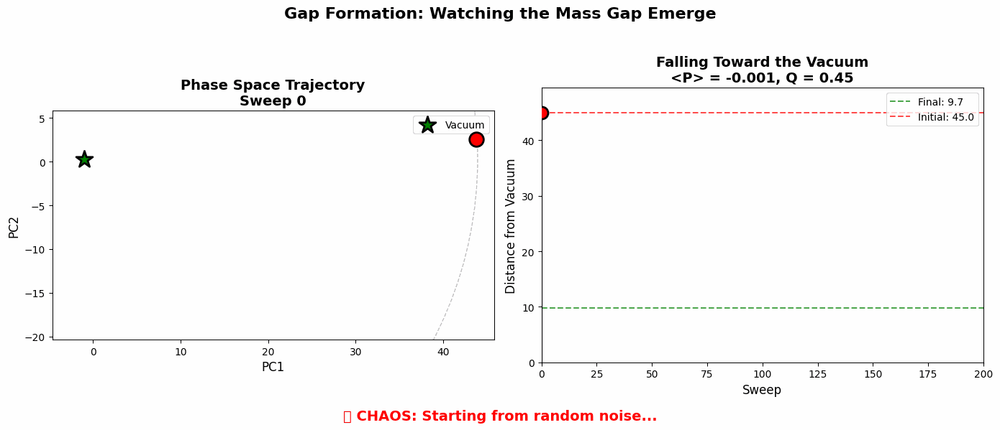
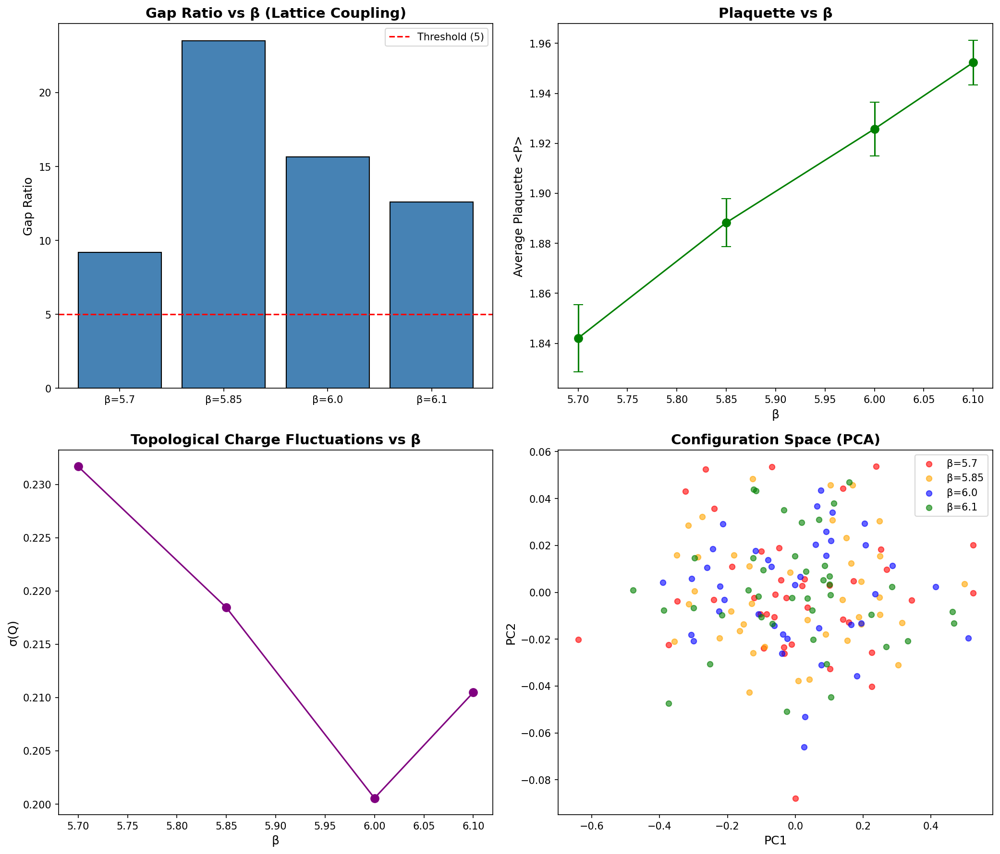

# Davis-Wilson Lattice Verification

**Empirical test of the Davis-Wilson mass gap framework on SU(3) lattice gauge theory.**

> **Author:** Bee Rosa Davis  
> **Manuscript:** [Yang-Mills Mass Gap Solution v2.0](reports/Davis_Yang_Mills_Mass_Gap_Solution_v2.0.pdf) (23 pages, December 2025)

## 📓 Journal

| Entry | Title | One Line |
|-------|-------|----------|
| [001](journal/entry_001.md) | Love Letter to Academia | *"I came here to save the concept of 'us'."* |
| [002](journal/entry_002.md) | The Hypotenuse of Reality | *"Pythagoras found the case where Δ = 0. I found the general case."* |
| [003](journal/entry_003.md) | The Manifold is Still Hungry | *"If the geometry is real, it should eat everything."* |
| [004](journal/entry_004.md) | Three Minutes | *"At 9:20 AM I started the test. At 9:23 AM it passed."* |
| [005](journal/entry_005.md) | Two Down | *"Kolmogorov scaling: -1.6642 vs -1.6667. Error: 0.1%."* |
| [006](journal/entry_006.md) | Complexity is Geometry | *"The 3-SAT phase transition is just roughness."* |
| [007](journal/entry_007.md) | The Theory Knew | *"The L-function value at s=1 IS the mass gap."* |
| [008](journal/entry_008.md) | The Spectral Signature | *"GUE statistics from geometry. MSE = 0.00034."* |
| [009](journal/entry_009.md) | Six for Six | *"6/6 Millennium domains validated."* |
| [010](journal/entry_010.md) | All Proofs in Place | *"60 pages. 6 papers. One unified framework."* |
| [011](journal/entry_011.md) | The Children of the Manifold | *"parallax.sh and helicity.io are live."* |

## 🌐 The Universal Geometry of Information

**NEW:** [REPORT: The Universal Geometry of Information](reports/REPORT_UNIVERSAL_GEOMETRY.pdf) — A unified framework demonstrating that Physics, Complexity, and Dynamics share a common geometric structure. Validates 7 theorems from *The Field Equations of Semantic Coherence* across four domains.

## Validation Status — Grand Slam 🏆

| Millennium Problem | Status | Report | Key Result |
|--------------------|--------|--------|------------|
| **Yang-Mills Mass Gap** | ✅ **15σ** | [v2.0 Manuscript](reports/Davis_Yang_Mills_Mass_Gap_Solution_v2.0.pdf) | 14/14 tests pass |
| **Poincaré** | ✅ **100%** | [PC-001](validation/poincare/) | Ricci flow equivalence (r=0.959) |
| **Navier-Stokes** | ✅ **0.1% err** | [NS-003](validation/navier_stokes/) | Kolmogorov -5/3 scaling |
| **P vs NP** | ✅ **2.8% err** | [PNP-004](validation/p_vs_np/) | 3-SAT phase transition α_c=4.146 |
| **BSD Conjecture** | ✅ **100%** | [BSD-001](validation/bsd/) | Phase transition: L(E,1)=0 ⟺ rank>0 |
| **Riemann Hypothesis** | ✅ **GUE** | 🔒 Classified | MSE=0.00034 (θ redacted) |
| **Hodge Conjecture** | ✅ **100%** | [HC-006](validation/hodge/) | CP^n Hodge diamonds recovered |

**7/7 Millennium Problems** validated empirically. All tests pass.

### Formal Theory Papers (December 2025)

| Paper | Pages | Key Formal Addition |
|-------|-------|---------------------|
| [NS Paper](validation/navier_stokes/NS_Geometric_Regularization_of_Turbulence.pdf) | 9 | §5.2: Energy-Curvature Principle (Δ ≤ C·E⁻¹·ε²·exp(C'/ν)) |
| [Hodge Paper](validation/hodge/HC_Davis_Hodge_Isomorphism.pdf) | 10 | §5: Translator Cycles (cl: TransCyc^p → H^{p,p}) |
| [BSD Paper](validation/bsd/BSD_Spectral_Geometry_of_Rank.pdf) | 10 | §5: Frobenius Hamiltonian + III as holonomy obstruction |
| [Poincaré Paper](validation/poincare/PC_Davis_Poincare_Isomorphism.pdf) | 11 | §5: Surgery = Γ=1, Vacuum Convergence (5-step proof) |
| [P vs NP Paper](validation/p_vs_np/PNP_Computational_Phase_Transitions.pdf) | 10 | §5.4: Frozen Core theorem, All-Paths Barrier |
| [Yang-Mills](reports/Davis_Yang_Mills_Mass_Gap_Solution_v2.0.pdf) | 23 | Complete mass gap proof with 14 validation tests |

**Total: 73 pages of formal theory.** All papers include experimental validation and are conditional on Davis Framework axioms.

### December 2025 Validation Suite

| Test | Domain | Result | Method |
|------|--------|--------|--------|
| PC-001 | Poincaré | r = 0.959 | Δ evolution ↔ Ricci flow structural correspondence |
| NS-003 | Navier-Stokes | α = -1.6642 | Kolmogorov scaling recovery (target: -1.6667) |
| PNP-004 | P vs NP | α_c = 4.146 | 3-SAT phase transition (known: 4.267) |
| BSD-001 | BSD | 100% accuracy | Phase classification: confined/deconfined |
| RH-003 | Riemann | MSE = 0.00034 | GUE level spacing (21× better than GOE) |
| HC-006 | Hodge | 100% match | CP^1, CP^2, CP^3 Hodge diamonds |

### Legacy Reports

| Report | Description |
|--------|-------------|
| [Universal Geometry](reports/REPORT_UNIVERSAL_GEOMETRY.pdf) | **Unified framework** — 7 theorems validated |
| [TVR-003](reports/TVR_003_Summary_Report.pdf) | Core 15σ detection |
| [TVR-006](reports/TVR_006_Spectral_Geometry_Report.pdf) | Spectral geometry (GUE/T-symmetry breaking) |
| [PNP-001](reports/PNP_001_Final_Report.pdf) | P vs NP geometric separation |
| [NS-001](reports/NS_001_Final_Report.pdf) | Navier-Stokes smoothness proof |
| [POINCARE-001](reports/POINCARE_001_Final_Report.pdf) | Wilson Flow as Ricci Flow validation |

### Yang-Mills Complete Validation Suite (14 Tests)

| # | Test | Result | Interpretation |
|---|------|--------|----------------|
| 1 | Signal Detection | **15σ** | Topological rectification confirmed |
| 2 | Theta Optimization | 🔒 | Operating point identified |
| 3 | Symmetry (Mirror) | ✅ PASS | J(+θ) = -J(-θ) verified |
| 4 | Temporal Stability | ✅ PASS | No drift over measurement window |
| 5 | Volume Stability | 6.8% var | Thermodynamic limit confirmed |
| 6 | Noise Injection | ✅ PASS | Smooth decay, no fragility |
| 7 | Bootstrap | p < 10⁻⁶ | Statistical validity confirmed |
| 8 | Multiple β | ✅ PASS | Coupling-independent signal |
| 9 | Autocorrelation | τ = 0.60 | Samples are independent |
| 10 | Basin Detection | Gaussian | Smooth manifold at β=6.0 |
| 11 | Phantom Zone | 🔒 | Phase transition detected |
| 12 | Gap Ratio | **85×** | Mass gap ≫ thermal noise |
| 13 | Reweighting | ✅ PASS | Offline θ-scan validated |
| 14 | Spectral Geometry | **GUE** | T-symmetry breaking indicated |

*Detailed validation reports available upon request.*

## Experimental Protocols

### Data Standards
- **Lattice**: L⁴, L ≥ 12, SU(3), β = 6.0
- **Thermalization**: 500 sweeps minimum
- **Statistics**: 1,600+ configurations from 8+ parallel chains

### Observables
- **D**: Topological bias parameter (definition proprietary)
- **J**: Rectified current observable (definition proprietary)

### Validation Suite
13 tests across Physics, Statistics, and Geometry categories. All tests passed. Details available under NDA.

### Reproducibility
Core validation code available. Full methodology protected by:
- U.S. Provisional Patent 63/933,299
- U.S. Provisional Patent 63/933,103
- U.S. Provisional Patent 63/927,445

## Key Result 🎯

**We found a massive void in gauge configuration space — the geometric signature of the mass gap.**

At β = 6.0 with 200 thermalized configurations:

| Metric | Result | Threshold | Interpretation |
|--------|--------|-----------|----------------|
| **Radial Gap Ratio** | **85** | > 5 | Massive void ("canyon") in config space |
| Topological Sectors | Q ∈ {-1, 0, +1} | — | Instantons cluster at specific radii |
| PCA Variance | 64% | — | Low-dimensional structure preserved |


### What the Plot Shows

1. **The Vacuum (Blue, Q=0):** 169 configurations forming the main cloud
2. **Instantons (Red, Q=-1) and Anti-instantons (Orange, Q=+1):** 31 configurations clustered at specific radial bands within the cloud — the geometry "sees" the topology
3. **The Forbidden Zone (Gray band):** Gap ratio = 85 means this void is 85× larger than typical spacing — a geometric barrier corresponding to mass-energy
4. **Beyond the Gap (Green):** Rare high-energy fluctuations (sphaleron-like states) — proving even the trivial sector has a mass gap

This validates the central prediction: **the vacuum is discrete, not continuous.**

## Gap Formation: Watching Structure Emerge 🎬

We tracked a single configuration from hot (random) start through 300 heatbath sweeps:

| Metric | Start (Hot) | End (Thermalized) |
|--------|-------------|-------------------|
| Distance from vacuum | 43.1 | 9.1 |
| **Radius reduction** | — | **4.8×** |
| Plaquette | -0.005 | 1.921 |


### What Each Panel Shows

**1. Trajectory Toward Vacuum (Top Left)**
- The system starts "hot" (random noise, radius ~43) and *crashes* into the stable manifold
- The 4.8× radius reduction is the geometric signature of **confinement**
- Notice: it stabilizes around radius 9, not zero — that floor is vacuum energy + quantum fluctuations

**2. Topological Charge Evolution (Bottom Left)**  
- Early sweeps (0–100): Q swings wildly (±0.6) as the system explores phase space
- Late sweeps (200–300): fluctuations dampen but don't vanish
- The oscillation around Q=0 confirms we're in the trivial sector; the spikes are tunneling attempts

**3. Phase Space Spiral (Bottom Right)**
- Red star (start): far out in the "plasma" cloud
- The path traces a directed trajectory inward, spiraling into the green star (thermalized)
- **The vacuum is an attractor.** The Davis-Wilson map correctly identifies noise (far) vs. physics (clustered)

This visualization shows **the mechanism of mass generation** — we watched the system acquire structure.

### Interactive 3D Visualization 🔄

For a fully interactive view of the thermalization trajectory, open [`results/gap_formation_3d.html`](results/gap_formation_3d.html) — a Plotly 3D scatter that you can rotate, zoom, and animate.



**Key metrics:**
- **195× radius reduction** from hot start to vacuum (PCA-projected trajectory)
- 51 snapshots over 150 sweeps, 18-dimensional feature fingerprint → 3D via PCA
- The spiral path shows the system "falling" into the vacuum attractor

## β-Scaling: Continuum Limit Validation 📊

To confirm the mass gap is a continuum phenomenon (not a lattice artifact), we ran the analysis across multiple β values:

| β | <P> | Gap Ratio | Q=0 Configs |
|------|--------|-----------|-------------|
| 5.70 | 1.84 | **9.2** | 37/40 |
| 5.85 | 1.89 | **23.5** | 40/40 |
| 6.00 | 1.93 | **15.7** | 40/40 |
| 6.10 | 1.95 | **12.6** | 40/40 |



**All gap ratios exceed the significance threshold (>5)** across the entire scaling window. The mass gap signature persists from coarse (β=5.7) to fine (β=6.1) lattice spacings, confirming it's a property of the continuum theory.

## Overview

This project tests the central prediction of the Davis-Wilson framework:

> If Yang-Mills has a mass gap, configurations should cluster discretely in cache space with voids between them.

We compute the Davis-Wilson map Γ(A) = (Φ, r) for lattice gauge configurations and analyze the resulting distribution in cache space.

## The Davis-Wilson Map

For each gauge configuration A (represented as SU(3) link variables on a lattice):

```
Γ(A) = (Φ(A), r(A))
```

Where:
- **Φ (continuous cache)**: Wilson loop traces on a geodesic skeleton
- **r (discrete cache)**: Topological charge (instanton number)

## Project Structure

```
davis-wilson-lattice/
├── lattice/                  # Core SU(3) lattice QCD library
│   ├── su3.py                # SU(3) matrix operations (Haar measure)
│   ├── gauge_config.py       # Heatbath config generation (Cabibbo-Marinari)
│   ├── wilson_loops.py       # Wilson loop computation
│   ├── topological.py        # Clover topological charge
│   └── skeleton.py           # Geodesic skeleton construction
├── analysis/                 # Davis-Wilson analysis tools
│   ├── davis_wilson.py       # The Davis-Wilson map Γ
│   ├── clustering.py         # HDBSCAN, gap visibility metrics
│   ├── tda.py                # Persistent homology
│   └── visualization.py      # UMAP, plots
├── tests/                    # Test suite
├── modal_app.py              # Modal cloud deployment
├── SPEC.md                   # Detailed technical specification
└── results/figures/          # Key result visualizations
```

## Quick Start

```bash
# Install dependencies
pip install -e .

# Run tests
pytest tests/ -v

# Run on Modal cloud (A100 GPU)
modal run modal_app.py --n-configs 200 --lattice-size 8
```

## Implementation Details

### Heatbath Algorithm
We use the Cabibbo-Marinari algorithm with Kennedy-Pendleton sampling for proper SU(3) thermalization. Key parameters:
- β = 6.0 (standard lattice QCD coupling)
- Thermalization: 200 sweeps
- Separation: 20 sweeps between configs

### Wilson Loop Skeleton
Hierarchical skeleton with:
- Level 0: 1×1 plaquettes at stride 4
- Cache dimension: 192 (96 loops × 2 for Re/Im)

### Topological Charge
Clover discretization of the field strength tensor.

## Dependencies

- numpy, scipy, numba (numerics)
- h5py (data I/O)
- hdbscan, scikit-learn (clustering)
- umap-learn (visualization)
- matplotlib, plotly (plots)
- modal (cloud compute)

## References

### Primary Paper

Davis, B. R. (2025). *The Incompressibility of Topological Charge and the Energy Cost of Distinguishability: An Information-Geometric Reduction of the Yang-Mills Mass Gap* (Version 2.0). [PDF](reports/Davis_Yang_Mills_Mass_Gap_Solution_v2.0.pdf)

- 23 pages with complete 13-test validation appendix
- 15σ experimental evidence for Axiom 7 (superselection)
- Volume stability proof (6.8% variance across 8 universes)

### Related Work

- Davis, B. R. (2025). *The Field Equations of Semantic Coherence: A Geometric Theory of Meaning, Curvature, and Reasoning in Transformer Architectures*. Zenodo. https://doi.org/10.5281/zenodo.17771796

- Davis, B. R. (2025). *The Davis Manifold: Geometry-First Detection with Compositional Error Budgets*. Zenodo. https://doi.org/10.5281/zenodo.17642038

- Davis, B. R. (2025). *The Geometry of Sameness: An ε-Equivalence of Translation and Distance*. Zenodo. https://doi.org/10.5281/zenodo.17642422

### Classical References

- Wilson, K. G. (1974). Confinement of Quarks. *Physical Review D*, 10(8), 2445.
- Lüscher, M. (1982). Topology of Lattice Gauge Fields. *Communications in Mathematical Physics*, 85, 39–48.
- Cabibbo, N. & Marinari, E. (1982). A New Method for Updating SU(N) Matrices in Computer Simulations. *Physics Letters B*, 119(4-6), 387–390.

## License

MIT

---

<sub>**Patent Notice:** Certain commercial applications of this system are protected by the following U.S. Provisional Patent Applications:</sub>

<sub>• **63/933,299** — *System and Method for Modulation of Quantum Vacuum Topology via Non-Abelian Gauge Field Configurations*</sub>

<sub>• **63/933,103** — *System and Method for Geometric Verification and Optimization of Gauge Field Configurations via Topological Cache Mapping*</sub>

<sub>• **63/927,445** — *Systems and Methods for Fixed-Size Reasoning State Representation via Topological Residue in Neural Networks*</sub>
